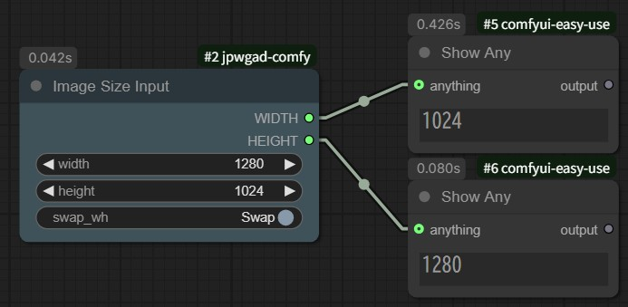
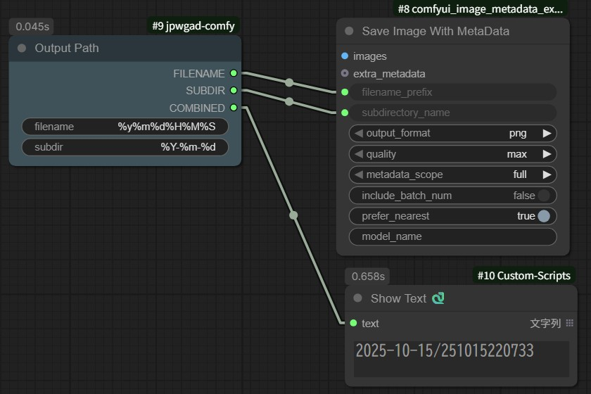
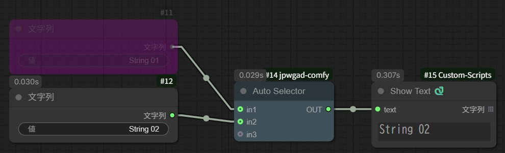
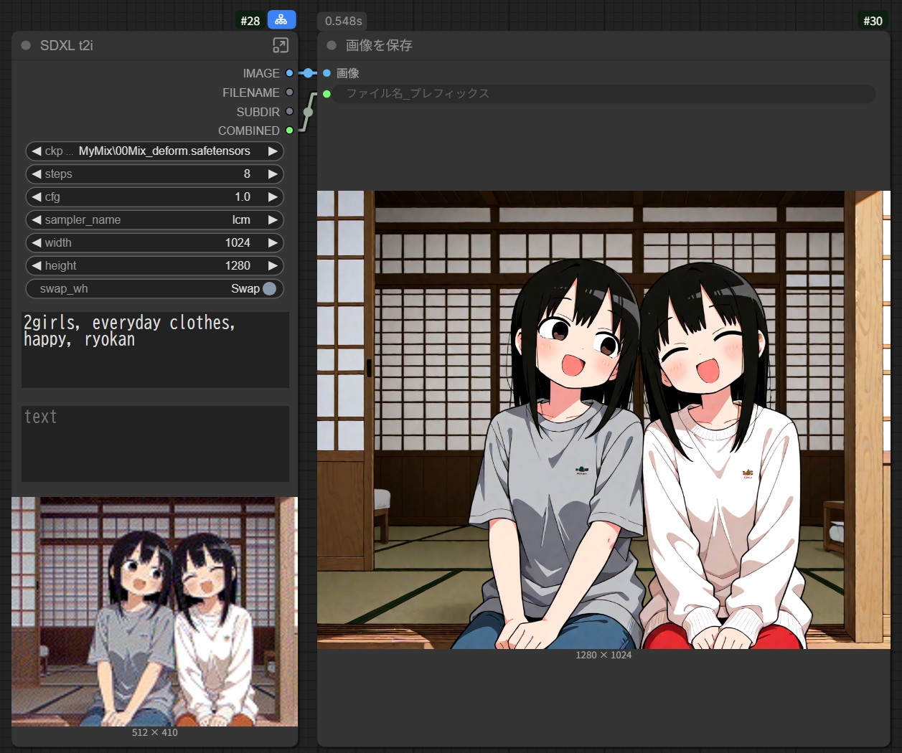

# jpwgad-comfy
ComfyUI nodes for my convenience.

## custom nodes

### SizeInput
Image Size Input  
from https://github.com/hayde0096/Comfyui-EasySettingpipes

- inputs:
    - `width`
    - `height`
    - `swap_wh` - swap width/height for output
- outputs:
    - `WIDTH` - `inputs.width` or `inputs.height`
    - `HEIGHT` - `inputs.height` or `inputs.width`

### OutputPath
Generate `strftime()` formatted output path

- inputs:
    - `filename` - default: `%y%m%d%H%M%S`  
        year:`%Y`, 2-digit year:`%y`, month:`%m`, day:`%d`,  
        hour:`%H`, min:`%M`, sec:`%S`
    - `subdir` - default: `%Y-%m-%d`  
        year:`%Y`, 2-digit year:`%y`, month:`%m`, day:`%d`,  
        hour:`%H`, min:`%M`, sec:`%S`
- outputs:
    - `FILENAME` - formatted `inputs.filename`
    - `SUBDIR` - formatted `inputs.subdir`
    - `COMBINED` - `SUBDIR`/`FILENAME`  
        if `SUBDIR` is empty, simply `FILENAME`

### AutoSelector

Outputs the first valid input (any type)
- inputs:
    - `in1`
    - `in2`
    - `in3`
- outputs:
    - `OUT` - first valid input in (`in1`, `in2`, `in3`)

## sample workflow
- simple_sdxl  
  using SizeInput and OutputPath
    